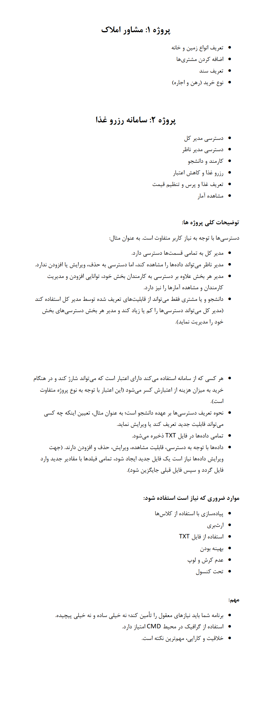

# **🍴🏠 Advanced Programming Food Reservation System & Real Estate System Project | پروژه برنامه‌نویسی پیشرفته سیستم رزرو غذا و سیستم مشاور املاک**

**A university project in which a food reservation system and a real estate consultant system related to the advanced programming course have been implemented.**

**یک پروژه دانشگاهی که در آن یک سیستم رزرو غذا و یک سیستم مشاور املاک مربوط به درس برنامه‌نویسی پیشرفته پیاده‌سازی شده‌است.**

# 💬 **نکات پروژه**

* عکس‌های برنامه در دایرکتوری ScreenShots قرار دارند.
* برای اجرا برنامه، به Java JDK 16 و یا بالاتر نیاز دارید.
* در پروژه در دایرکتوری مربوط به خود قرار گرفته است.
* برای دسترسی به همه‌ی پروژه‌های دانشگاهی من، به این لینک مراجعه کنید:

👈🏻 **[پروژه‌های دانشگاهی من](https://github.com/bestmahdi2/Uni__Bachelors_SKU_Path)**

# 📝 **توضیحات پروژه**

# 🖼 **عکس‌های پروژه**

  
  
  

